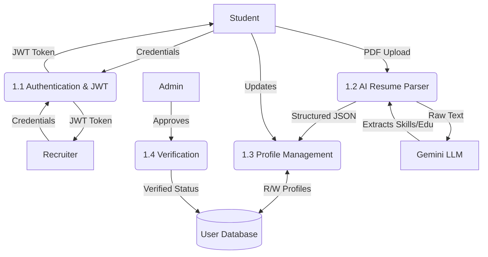
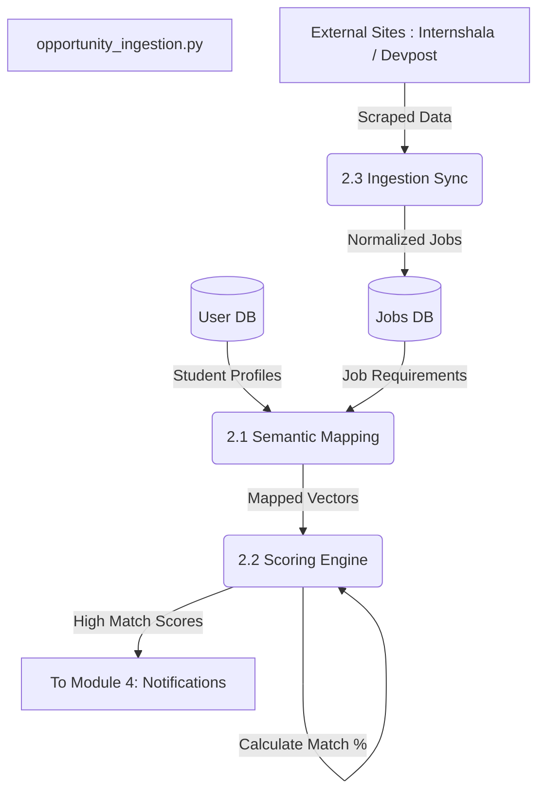
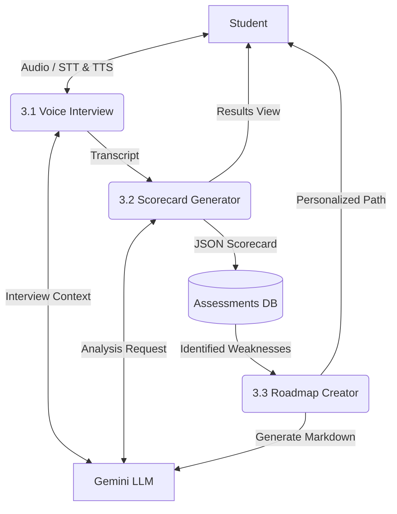
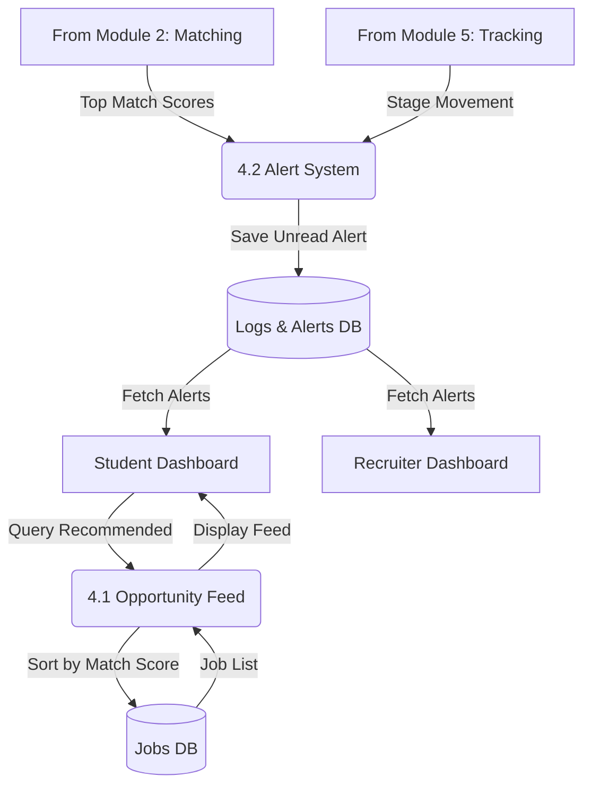
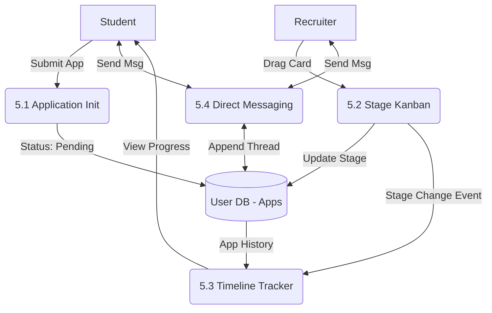

# Core Modules: Mermaid Data Flow Diagrams

This document contains Mermaid.js diagrams illustrating the data flows and architecture for each of the 5 Core Modules in the StudentHub platform. Markdown viewers with Mermaid support (like GitHub or many VSCode previewers) will render these automatically.

---

## 1. User & Profile Management

---

## 2. Evaluation & Matching

---

## 3. Learning & Feedback

---

## 4. Recommendation & Notification

---

## 5. Communication & Tracking

